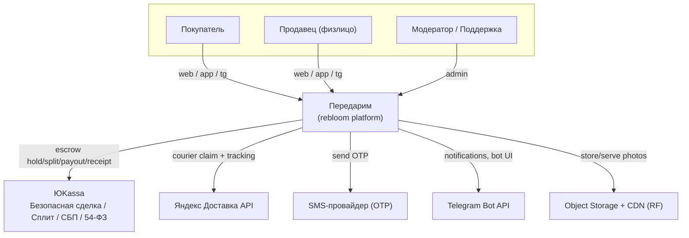
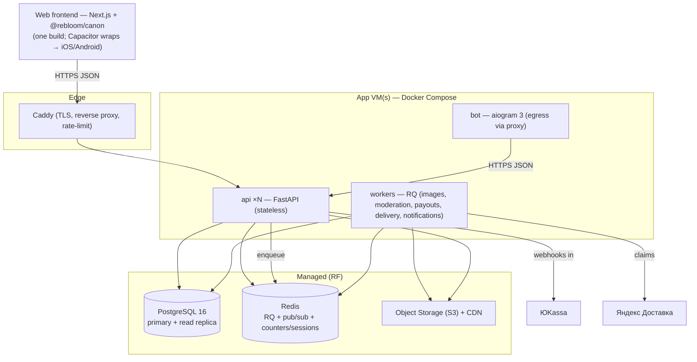
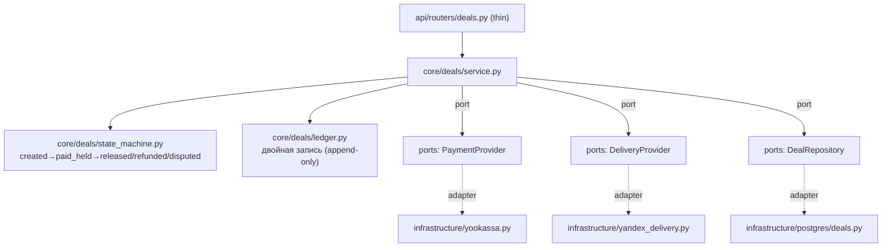
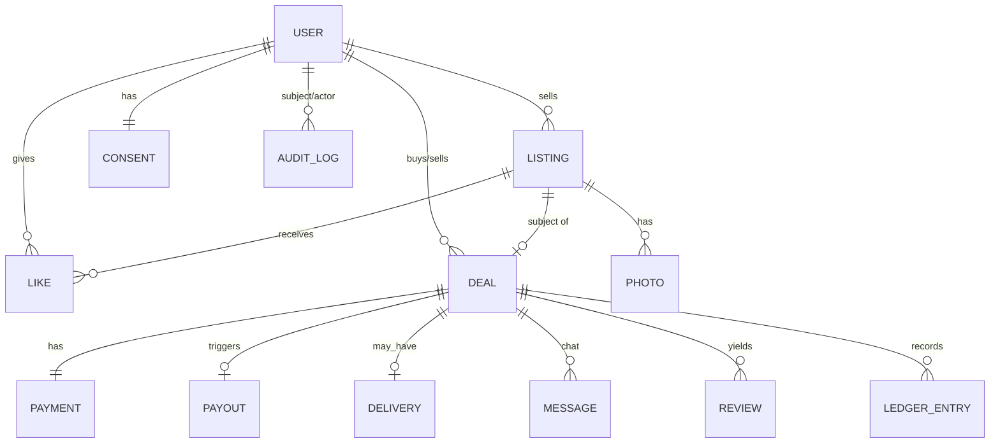
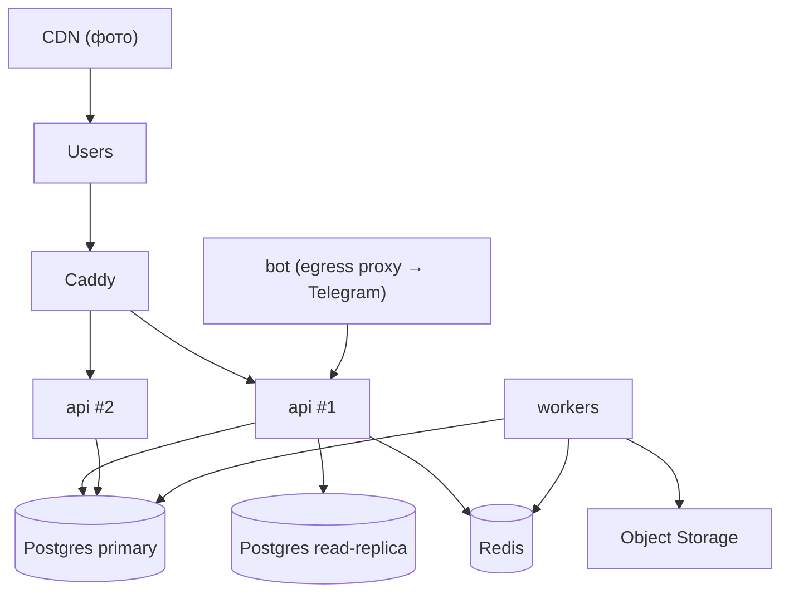

# ARCHITECTURE — Передарим (code-name `rebloom`)

> ⚠️ **ОБНОВЛЕНО — ADR-0013 (запуск без эскроу).** Денежный путь (эскроу/ЮKassa/ledger/выплаты/webhook) **исключён из MVP**: сделка = `agreed → meeting → done`(+`problem`/`cancelled`), деньги не проходят через платформу (оплата при встрече). Код `core/payments`, `core/deals/ledger.py`, `infrastructure/yookassa.py` остаётся в репо **DORMANT** (маршруты не зарегистрированы, тесты зелёные) — основа для будущего ADR монетизации. Разделы §3–§7 про эскроу/ЮKassa/ledger/PCI ниже — для MVP читать по ADR-0013.

> **Action title:** Modular monolith (FastAPI + Postgres + Redis) с hexagonal-ядром для денежных и PII-модулей; единый backend обслуживает один **web-фронт** (Next.js + `@rebloom/canon`, верифицируемый в Claude Design), который Capacitor оборачивает в iOS/Android (тот же build), и Telegram-бот (aiogram); деньги — через ЮKassa «Безопасная сделка»; всё хостится в РФ (ФЗ-152).

**TL;DR**
- **Стек:** Python 3.12 / FastAPI / SQLAlchemy 2.0 / Postgres 16 (managed, RF) / Redis (RQ + pub/sub) / **Next.js (App Router) + Tailwind + `@rebloom/canon`** (web, верифицируемый источник из Claude Design) + **Capacitor** (обёртка → iOS/Android) / aiogram 3 / ЮKassa / Яндекс Доставка / Yandex Object Storage + CDN.
- **Стиль:** modular monolith, hexagonal core в модулях `payments / deals / auth / listings / reviews / moderation`; один деплой, горизонтально масштабируемый API.
- **Почему:** одна команда, скорость TTM, единая дизайн-система на все каналы, деньги требуют сильных инвариантов в чистом ядре, а не распределённой саги между микросервисами на старте.

---

## 0. Бренд и code-name (решено)

| Поле | Значение |
|---|---|
| Публичный бренд | **«Передарим»** (кириллица в customer-facing copy) |
| Домен | **peredarim.ru** |
| Инженерное code-name | `rebloom` (repo, package paths, env vars, Docker tags, DB) — `vitrina`-конвенция: code-name ≠ product name |
| Telegram-бот | `@PeredarimBot` `[verify: доступность]` |

«Передарим» точно ложится на модель: подаренный букет **передаривается** дальше за деньги. В коде везде остаётся `rebloom` — это намеренно, чтобы возможный ребрендинг не трогал кодовую базу. Отклонённые варианты (для истории): «Перецвет», «Второцвет», «Букетим».

## 1. Quality goals (ранжированы)

1. **Целостность денег.** Эскроу никогда не должен дважды релизнуть, потерять или «подвесить навсегда» средства. Сильнее перформанса.
2. **Time-to-first-prototype < 2 недель** до закрытой первой реальной сделки в одном городе.
3. **Maintainability одной командой** — единое ядро, единая дизайн-система, минимум подвижных частей.
4. **Sub-200ms p95 чтения** при image-heavy ленте за счёт CDN и денормализованных счётчиков.

## 2. Constraints

- **Технические:** хостинг и ПДн — в РФ (ФЗ-152); **Telegram API заблокирован с RF-VPS** (факт из `vitrina/OPERATIONS`) → бот-egress только через прокси/relay вне РФ или managed-обход (см. §12, OPERATIONS §4); карт. данные не должны попадать на наш backend (PCI-scope минимизируем токенизацией у ЮKassa).
- **Организационные:** малая команда + Claude Code; UI рождается в Claude Design и вендорится пакетом `@rebloom/canon` (round-trip, не править вручную). **Требование (результат): один UI-кодбейс на web/iOS/Android, без отдельной разработки под платформу.** Поскольку верифицируемый выход Claude Design — это web (HTML/React/CSS) + токены, рантайм держим web на всех платформах: один **Next.js**-фронт на `@rebloom/canon`, обёрнутый **Capacitor** в iOS/Android (тот же build). Никакого Swift/Kotlin/RN UI; `mobile/` — только конфиг (ADR-0004).
- **Регуляторные:** 152-ФЗ, 54-ФЗ (чеки), 115-ФЗ (AML/KYC на стороне провайдера), правила сторов (Apple 4.2/4.3 — закрываем нативными фичами; физические товары → не подпадают под обязательный Apple IAP).

## 3. C4 Level 1 — System Context

## 4. C4 Level 2 — Containers

- **Языки/протоколы:** Python 3.12 (api/worker/bot); HTTP/JSON между фронтами и API; Redis-протокол; S3 API; вебхуки ЮKassa (HTTPS, подпись).
- **API-контракт:** envelope `{ "ok": true, "data": {...} }` / `{ "ok": false, "error": "code", "request_id": "..." }`.

## 5. C4 Level 3 — Components (самый сложный контейнер: `api` → ядро `deals`)

**Dependency rule:** `core/**` НЕ импортирует `infrastructure/**`; зависимости направлены внутрь, к домену. Внешние сервисы — только через порты (Protocol-интерфейсы), адаптеры живут в `infrastructure/` (enforced import-linter).

## 6. Data model (ключевые сущности; 🔒 = PII/чувствительное)

- **USER** — id(UUID), 🔒phone, display_name, 🔒city_id, roles[buyer,seller,moderator,admin], seller_rating, created_at.
- **CONSENT** 🔒 — user_id, policy_version, accepted_at, source_channel (152-ФЗ).
- **LISTING** — id(UUID), seller_id, size(S/M/L/XL), freshness(today/1-2d/3+d), price_kopecks, city_id, 🔒geo(coarse), status(draft/pending_review/active/reserved/sold/archived), like_count, freshness_score, expires_at.
- **PHOTO** — id, listing_id, object_key, variants(thumb/card/full), exif_stripped(bool), moderation_status.
- **LIKE** — (user_id, listing_id) unique, created_at → top-лента.
- **DEAL** — id(UUID), listing_id, buyer_id, seller_id, amount_kopecks, commission_kopecks, status(created/paid_held/released/refunded/disputed/cancelled), delivery_method(self_pickup/courier), created_at, released_at.
- **PAYMENT** — deal_id, yk_payment_id, status, idempotency_key, captured_at. (Карт. данные НЕ хранятся.)
- **PAYOUT** — deal_id, yk_payout_id, 🔒payout_target(masked), status, fiscal_receipt_id.
- **DELIVERY** — deal_id, provider_claim_id, 🔒pickup/dropoff(coarse until accepted), tracking_status.
- **MESSAGE** 🔒 — deal_id, sender_id, body(модерируется на контакты), created_at.
- **REVIEW** — deal_id, author_id, target_id, score(1-5), text, moderation_status.
- **LEDGER_ENTRY** — append-only двойная запись по сделке (hold/commission/payout/refund) — источник истины по деньгам.
- **AUDIT_LOG** — actor, action, target, reason, request_id, ts (immutable).
- **EVENT** 🔒 — user_id?/anon_id, type, platform(web/ios/android), source/utm, ip, city_id?, ts (DAU/MAU/воронки/прирост/атрибуция).
- **SESSION** 🔒 — user_id, platform, ip, user_agent, device_fingerprint, started_at, last_seen_at (online = Redis TTL-heartbeat).
- **IP_LOG** 🔒 — user_id ↔ ip ↔ device (мульти-аккаунт детект).
- **FRAUD_SIGNAL** — user_id|deal_id, type, score, evidence, status; агрегат `user.risk_score`.
- **USER_REPORT** — жалобы на объявление/юзера.
- **USER** += status(active/limited/blocked), blocked_reason, risk_score.
> Подробности админ/аналитики/антифрода — `docs/handoff/ADMIN_BACKEND_TZ.md`.

## 7. Data flow (по сценариям)

**Покупка с эскроу (sc. 2–3):**
1. `POST /deals` (buyer, listing) → DEAL `created`, listing → `reserved`, LEDGER `hold_intent`.
2. `api` создаёт платёж в ЮKassa «Безопасная сделка» → возвращает confirmation_url/token.
3. Покупатель платит → ЮKassa шлёт **webhook** `payment.succeeded` → `api` (идемпотентно по yk_payment_id) → DEAL `paid_held`, LEDGER `held`, открыт чат.
4. Передача: self_pickup (чат+гео) или courier (worker создаёт claim в Яндекс Доставка, трекинг в сделке).
5. Покупатель жмёт «Подтвердить получение» → DEAL `released` → worker инициирует split-payout продавцу (минус commission) + запрос чека (54-ФЗ) → LISTING `sold`, LEDGER `released+commission`.
6. Включаются взаимные отзывы (14 дней).

**Спор:** до релиза любая сторона → DEAL `disputed`, деньги заморожены; поддержка решает → `released`/`refunded`/частичный; всё в AUDIT_LOG + LEDGER.

## 8. Tech stack table

| Layer | Choice | Why | Alternatives rejected |
|---|---|---|---|
| Backend | Python 3.12 + FastAPI | async, типы, скорость разработки, совпадает с вашим `vitrina`-опытом | Node/Nest (меньше опыта), Go (медленнее TTM) |
| ORM/DB | SQLAlchemy 2.0 + Postgres 16 (managed) | транзакции/инварианты денег, JSONB, full-text, надёжность | Mongo (нет транзакций под деньги на старте) |
| Cache/queue/realtime | Redis + RQ | очереди (image/moderation/payout), счётчики лайков, сессии, pub/sub для чата | Celery+RabbitMQ (тяжелее) |
| Frontend (web) | **Next.js (App Router) + Tailwind + `@rebloom/canon`** | верифицируемый в Claude Design web-canon = источник истины; SSR/SEO для лендинга и карточек; pixel-diff baselines | CRA/SPA (хуже SEO) |
| Mobile iOS/Android | **Capacitor-обёртка того же web-build** | один build = mobile web = iOS = Android, без отдельной разработки под платформу; device-фичи (camera/geo/push/share) через плагины (конфиг, не отдельный UI) | Expo/RN universal — отклонён: Claude Design не верифицирует RN-canon → раздвоение и дрейф (ADR-0004); нативные ×2 — запрещено требованием |
| Bot | aiogram 3 | зрелый async TG-фреймворк | telebot (менее гибкий) |
| Payments | ЮKassa «Безопасная сделка» + Сплит + СБП | C2C-эскроу, выплаты физлицам/самозанятым, 54-ФЗ, #1 по охвату | CloudPayments (нет escrow-продукта, дороже), Т-Касса (резерв) |
| Delivery | Яндекс Доставка API | покрытие 10 городов, same-day, API | локальные курьеры (фрагментировано) `[verify: API/лимиты]` |
| Storage | Yandex Object Storage (S3) + CDN | РФ-резидентность, дёшево, CDN под фото | self-host MinIO (операционно дороже под нагрузкой) |
| Edge | Caddy | авто-TLS, простой rate-limit, как в `vitrina` | nginx (больше ручного) |
| SMS OTP | RF SMS-провайдер (SMS.ru / MTS Exolve) | OTP-логин | — `[verify: провайдер/цена]` |
| Observability | OpenTelemetry + Prometheus/Grafana + GlitchTip | трейсы денежных путей, РФ-резидентные ошибки | Sentry SaaS (данные вне РФ) |

## 9. Architectural style

**Modular monolith** — одна команда (<5 инженеров), деньги требуют ACID-инвариантов в одной транзакции, микросервисы добавили бы распределённые саги без выгоды на старте (школа DHH/Shopify). Модули: `auth, users, listings, photos, likes, feed, deals, payments, delivery, reviews, moderation, notifications, admin, analytics, fraud`. Границы модулей — внутренние пакеты, общение через сервисные интерфейсы, не общие таблицы.

## 10. Maintainability strategy — **Hexagonal (Ports & Adapters)** для высокорисковых модулей

- Применяем гексагон к `payments / deals / auth / listings(content) / reviews / moderation` (бизнес-правила + инварианты денег).
- CRUD-модули (`feed`, `likes`, простые `users`) — тонкий layered (router→service→repo) без избыточных портов.
- **Dependency rule (enforced):** `app/core/**` не импортирует `app/infrastructure/**`; внешние эффекты — через `ports` (typing.Protocol), адаптеры — в `infrastructure/`. Проверяется `import-linter` в CI.

## 11. Deployment topology

- **Где что:** `api ×2 / workers / bot / redis / caddy` — Docker Compose на RF-VM(ах); **Postgres и Redis — managed** (HA, бэкапы), не self-host под деньги. Фото — Object Storage + CDN.
- **Сети:** только Caddy наружу (443); внутренние сервисы — приватная сеть; webhooks ЮKassa — отдельный путь с проверкой подписи + allowlist IP.
- **Секреты:** только в `/opt/rebloom/.env` на VM / в secret-store провайдера; никогда в git (pre-commit gitleaks).

## 12. Cross-cutting concerns

- **Logging:** structured JSON + `request_id`; PII-маскирование на уровне логгера (`[PHONE]`,`[EMAIL]`).
- **Tracing:** OpenTelemetry span'ы на `deal`/`payment`/`payout`.
- **Error handling:** домен возвращает `Result[T, DomainError]`; исключения — только на границе api; клиенту — без стектрейсов.
- **Feature flags:** простой Redis/DB-флаг для поэтапной раскатки городов и каналов.
- **Config:** Pydantic Settings из env; `extra='forbid'`.
- **Telegram egress:** бот-исходящие к `api.telegram.org` идут через прокси/relay вне РФ (RF-VPS блокирует TG) — конфиг в OPERATIONS §4, ADR-кандидат.
- **Realtime:** чат и live-лайки — WebSocket через `api` + Redis pub/sub; деградация до polling.

## 13. Trade-offs accepted

- **Web-runtime на всех платформах (один кодбейс):** Claude Design верифицирует web (превью→скриншот→pixel-diff), поэтому web-build держим рантаймом и на iOS/Android (Capacitor) — то, что нарисовано и проверено, и едет везде; идентичность гарантирована по построению, нет двойного авторинга дизайн-системы. Цена — WebView чуть менее «нативный» по ощущению; риск Apple 4.2 закрываем реальными device-фичами (camera/geo/push) + физтовар (не IAP). Натив (Expo) отклонён: Claude Design не даёт верифицируемый RN-canon (ADR-0004).
- **Modular monolith:** жертвуем независимым масштабированием модулей ради простоты; денежное ядро изолировано гексагоном, вынос в сервис возможен позже без переписывания домена.
- **Managed Postgres/Redis (дороже VPS):** платим за HA/бэкапы — оправдано для денег.
- **Один эквайер (ЮKassa) на старте:** vendor lock-in; смягчён портом `PaymentProvider` (адаптер можно добавить для Т-Кассы/CloudPayments).

---

## Open questions
- Прокси/relay для Telegram-бота: managed-сервис или собственный узел вне РФ?
- Read-replica с day-1 или включаем по триггеру нагрузки?
- WebSocket-чат в MVP или статус-уведомления + контакт после оплаты (см. PRD open questions)?
