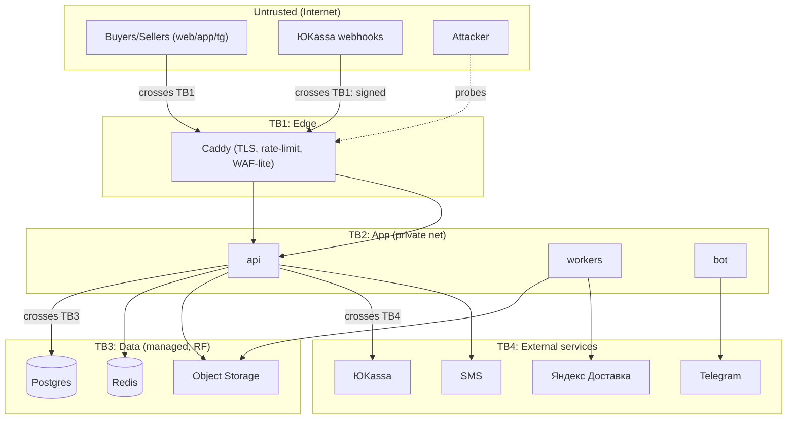

# SECURITY — Передарим (code-name `rebloom`)

> **Heaviest artifact.** Read before any change to `core/{auth,payments,deals,listings,photos,reviews,moderation,consent}`.

> ⚠️ **ОБНОВЛЕНО — ADR-0013 (запуск без эскроу).** Платформа не держит и не двигает деньги (оплата при встрече), поэтому **из MVP-скоупа сняты** связанные с эскроу/оплатой угрозы: **T-02** (forged webhook), **T-03** (double-release race), **T-12** (reservation DoS на оплату — переосмыслен как agreement-timeout) — они вернутся вместе с монетизацией (отдельный ADR), а соответствующий код dormant. Остаточный денежный риск несётся P2P при встрече (нет предоплаты), смягчается репутацией/модерацией/жалобами. T-05 (увод контактов), T-06 (IDOR), T-13 (раскрытие адреса после `meeting`), T-10/16 (ПДн/ФЗ-152), T-14/15 — **в силе без изменений**.

## 1. TL;DR

- **Top risks:** (1) **escrow integrity / payment-flow abuse** — double-release, replayed webhooks, race on deal release → прямые финансовые потери; (2) **PII exposure (ФЗ-152)** — телефоны, адреса встреч, лица на фото → утечка + штраф/реестр РКН; (3) **C2C abuse & off-platform leakage** — фрод «оплатил-не получил», увод сделки в офлайн, фейковые/чужие фото, контакты в чате.
- **Top mitigations:** (1) **idempotent signed webhooks + append-only ledger + state machine с одним легальным путём релиза + DB-блокировки на сделке**; (2) **EXIF/гео-стрипинг, маскирование ПДн в логах, шифрование адресов at-rest (AES-256-GCM), хранение в РФ, согласия 152-ФЗ**; (3) **escrow по умолчанию + модерация фото/текста (лица/контакты), rate-limit, репутация/отзывы, anti-fingerprint на дублях фото**.
- **Карт. данные не касаются нашего backend** — токенизация и хранение у ЮKassa (PCI-scope провайдера); мы храним только `yk_payment_id`/статусы.

## 2. Assets & trust boundaries

**Protected assets:** escrow-средства и ledger; ПДн (🔒 телефоны, имена, адреса/гео встреч, фото с возможными лицами); сессии/токены; payout-реквизиты; админ-доступ; webhook-секреты/ключи провайдеров; модели/правила модерации.

Boundary crossings = места кластеризации угроз: **TB1** (любой внешний ввод + webhooks), **TB3** (доступ к данным/деньгам), **TB4** (внешние деньги/доставка/каналы).

## 3. Threat model — STRIDE-per-interaction

| ID | Boundary | STRIDE | Threat (vector → outcome → motivation) | L | I | Mitigation (specific) | Verifying control |
|---|---|---|---|---|---|---|---|
| T-01 | TB1 buyer→api auth | S | Attacker brute-forces / sprays OTP for a victim phone → account takeover → resale fraud | M | H | OTP 6-digit, TTL 5 min, ≤5 attempts/15min, lockout 1h, per-phone+per-IP rate-limit, no user enumeration in responses | `tests/security/test_otp_bruteforce.py`; Redis counter assertions |
| T-02 | TB1 → api webhook | T/S | Attacker forges `payment.succeeded` to flip deal to `paid_held` without paying → free goods | M | H | Verify ЮKassa **HMAC/signature** + source IP allowlist; never trust body alone; re-fetch payment status from ЮKassa API before state change | `test_webhook_signature.py`; deny test from non-allowlisted IP |
| T-03 | TB2 deals service | E/T | Race: two concurrent "confirm receipt" / retried webhook → **double payout** | M | H | `SELECT ... FOR UPDATE` on deal row; state machine rejects illegal transitions; payout idempotency_key; append-only ledger reconciles | `test_double_release_race.py` (concurrent); ledger invariant test |
| T-04 | TB1 listing photo upload | T/I | Malicious upload: oversized, polyglot, SVG-XSS, embedded EXIF-GPS doxxing seller | M | M | Validate MIME + magic bytes, re-encode to JPEG/WebP (strip EXIF/GPS), size/dimension caps, no SVG, store under random keys, serve from CDN with `Content-Disposition`/no-sniff | `test_upload_fuzz.py`; verify re-encoded output has no EXIF |
| T-05 | TB2 chat / reviews | R/I | User posts phone/Telegram to take deal off-platform → escrow bypass + fraud | H | M | Contact-pattern detection (regex+model) → hold/strip; nudge UX; off-platform = no escrow protection messaging | `test_contact_leak_filter.py` |
| T-06 | TB1 listing detail | E | IDOR: `GET /deals/{id}` of another user's deal → PII (address, phone-adjacent) leak | M | H | Default-deny authz; ownership check (buyer or seller of that deal) on every deal/chat/photo route; object-level guard | `test_authz_idor.py` for every endpoint |
| T-07 | TB4 ЮKassa adapter | I | Logging payment payloads leaks tokenized refs / PII to log store | M | M | Structured logging with PII redaction; never log full provider payloads; secrets never logged | `test_log_redaction.py` (assert masks) |
| T-08 | TB1 feed/api | D | Scraper / bot floods feed + image endpoints → cost + DoS | M | M | Per-IP + per-user rate-limit (Caddy + app), CDN for images, pagination caps, captcha on signup spike | load test; rate-limit unit test |
| T-09 | TB2 moderation bypass | S/T | Seller uploads someone else's bouquet photo / stale flowers as fresh → buyer fraud | H | M | Perceptual-hash duplicate detection, reverse-image flag, freshness self-attestation + buyer dispute window before release | `test_phash_duplicate.py` |
| T-10 | TB3 data at rest | I | DB/backup compromise → mass PII (phones, meeting addresses) leak | L | H | Encrypt sensitive columns (addresses/geo) AES-256-GCM app-side; managed Postgres at-rest encryption; least-priv DB roles; backups encrypted, RF region | schema review; `test_pii_encryption.py` |
| T-11 | TB2 admin | E/R | Compromised/abusive admin issues fraudulent refund/release | L | H | Admin 2FA (TOTP), RBAC, **every money/moderation action → immutable audit log**, 4-eyes for refunds above threshold | `test_admin_audit.py`; audit immutability test |
| T-12 | TB1 deal create | D/E | Buyer mass-reserves listings without paying → DoS of inventory | M | M | Reservation TTL 30 min auto-release, per-user concurrent-reservation cap, reputation gating | `test_reservation_expiry.py` |
| T-13 | TB4 delivery | I | Address shared to courier/other party before deal is paid → doxxing | M | M | Coarse geo until `paid_held`; exact address revealed only to active counterparty/courier post-payment; auto-expire after deal | `test_address_disclosure_gate.py` |
| T-14 | TB1 bot | S | Spoofed Telegram updates / unverified user link → act as another user | M | M | Verify Telegram update authenticity; link TG id to verified phone-account only via OTP; bot egress via trusted proxy | `test_bot_identity_link.py` |
| T-15 | TB2 LLM moderation | T | Prompt-injection via listing text/photo OCR to bypass moderation | M | M | Treat model output as untrusted; tag user content `<user_content>`; never execute model output; fail-closed to manual review | `test_moderation_prompt_injection.py` |

| T-16 | TB2 admin | I/R | Admin abuses access to PII/IP or edits user data without basis → privacy breach (ФЗ-152) | L | H | Role-gate + 2FA + IP-allowlist; PII/IP access & user-edit are audited (actor/reason); `analyst` sees only anonymized aggregates | `test_admin_pii_access_audited.py` |
| T-17 | TB2 admin/analytics | T | Tampering with metrics/finance reports (turnover/commission) | L | M | Finance derived from append-only ledger; reports read-only; admin actions audited; daily reconciliation | ledger-reconciliation test |
| T-18 | TB1 signup | S | Ban evasion / mass multi-accounting (same IP/device) to farm reviews or scam | M | M | IP/device fingerprint logging, multi-account clustering + fraud signals, block propagation | `test_multiaccount_cluster.py` |

Likelihood/Impact: L/M/H. **All H-impact rows have an automated verifying control in `tests/security/`.**

## 4. OWASP Top 10:2025 mapping

`[verify: точные формулировки категорий OWASP Top 10:2025, finalized OWASP Global AppSec DC, 2025-11-06]`

| Cat | Applies | Why / Mitigation in THIS system | Owner | Verification |
|---|---|---|---|---|
| **A01 Broken Access Control** | **Y** | Default-deny routing; object-level ownership on deals/chats/photos/payouts; roles buyer/seller/moderator/admin; IDOR-prevention (T-06) | `core/auth`, every router | negative authz tests per endpoint; route audit lint |
| **A02 Security Misconfiguration** | **Y** | Hardened Caddy defaults; security headers CSP, HSTS, X-Content-Type-Options=nosniff, Referrer-Policy=strict-origin, Permissions-Policy; no debug in prod; managed-DB baseline | `infra/`, `api/middleware` | header test; `make security-check`; compose config lint |
| **A03 Software Supply Chain Failures** | **Y** | Pinned versions + committed lockfiles (poetry.lock / package-lock.json); CI fails on drift; SBOM gen; signed releases; dependency-review; namespace-squat check; canon vendored & diff-verified | CI, `packages/canon` | `pip-audit`/`npm audit` gate; lockfile-drift CI; SBOM artifact |
| **A04 Cryptographic Failures** | **Y** | TLS 1.3 edge; AES-256-GCM for sensitive columns (addresses/geo); **Argon2id** for any password/admin-recovery; HMAC for webhook verify; no MD5/SHA1; no homemade crypto; key custodian = secret store, rotation 90d | `core/crypto`, `infra` | crypto lint (ban md5/sha1); `test_pii_encryption.py` |
| **A05 Injection** | **Y** | SQLAlchemy ORM / `text(":param")` only (no f-string SQL); output encoding; structured logs (no log-injection); subprocess args never string-concat; `<user_content>` tagging into LLM | all data access | bandit; `test_no_raw_sql`; import-linter |
| **A06 Insecure Design** | **Y** | This threat model; escrow-by-default; state machine + ledger as secure-by-design money pattern; abuse cases (T-05/T-09/T-12) modeled | architecture | design review; ADR-0003 |
| **A07 Authentication Failures** | **Y** | Passwordless phone+OTP (FR-001..003); revocable server-side sessions (Redis), short TTL + refresh; lockout; admin TOTP 2FA; secure cookie flags HttpOnly/Secure/SameSite=Lax | `core/auth` | `test_otp_*`, session-revocation test |
| **A08 Software/Data Integrity Failures** | **Y** | SRI for any CDN script; verify webhook + provider responses; signed deploy artifacts; ledger append-only integrity; no untrusted deserialization (JSON only, Pydantic `extra='forbid'`) | `landing`, `core/deals` | SRI test; ledger hash-chain test |
| **A09 Security Logging & Alerting Failures** | **Y** | Structured logs w/ correlation id; **audit log** for auth/payout/refund/moderation/admin; PII/secrets NOT logged; retention 1y audit / 30d app; alerts on failed-login spike, 4xx/5xx spike, webhook-signature failures | `core/*`, observability | `test_log_redaction.py`; alert rule tests |
| **A10 Mishandling of Exceptional Conditions** | **Y** | Fail-secure: payment/payout errors keep funds held, never auto-release; `Result[T,E]` domain, exceptions only at boundary; no stack traces to clients; circuit-breaker on provider outages | all | `test_payment_failure_keeps_held.py`; error-shape test |

## 5. AuthN / AuthZ design

- **Identity:** **build (phone+OTP)**, не внешний IdP — РФ-аудитория без email-привычки, дешевле, контроль ПДн в РФ. SMS через RF-провайдера. TG-аккаунт линкуется к верифицированному телефону.
- **Session:** **server-side opaque tokens в Redis** (revocable, short TTL + refresh) вместо долгоживущих JWT — для денежного приложения важна мгновенная отзывность сессий. Cookie: `HttpOnly; Secure; SameSite=Lax`. Mobile (Capacitor) — токен в secure storage (`@capacitor/preferences` + Keychain/Keystore).
- **AuthZ model:** **RBAC + resource-ownership (ReBAC-lite)**. Роли: `buyer`, `seller` (любой user может быть обоими), `moderator`, `support`, `admin`.

| Action | buyer | seller | moderator | support | admin |
|---|---|---|---|---|---|
| publish listing | – | own | – | – | – |
| buy / create deal | ✓ | ✓ | – | – | – |
| read deal/chat | own | own | – | assigned dispute | ✓ |
| confirm receipt | own deal | – | – | – | – |
| moderate listing/review | – | – | ✓ | ✓ | ✓ |
| refund / force-release | – | – | – | within limit | ✓ (4-eyes > threshold) |
| view audit log | – | – | – | – | ✓ |

## 6. Secrets management

- Секреты **только** в secret-store провайдера / `/opt/rebloom/.env` на VM; **никогда в git**. `.env.example` коммитится, реальный `.env` в `.gitignore`.
- Pre-commit: **gitleaks** + `detect-secrets` (`.secrets.baseline`), commit-msg hook.
- Ротация: webhook/API-ключи провайдеров — 90 дней; немедленный отзыв при инциденте. Custodian — основатель + secret-store.
- Никаких секретов в кодовых дефолтах, логах, ошибках, LLM-промптах.

## 7. Dependency hygiene

- Lockfiles (`poetry.lock`, `package-lock.json`) коммитятся; CI падает на drift.
- SCA: `pip-audit` + `npm audit` (high+) в CI; Dependabot/Renovate.
- License allowlist (MIT/BSD/Apache-2.0/ISC); copyleft — через ADR.
- **Max-age policy:** нет рантайм-зависимости старше 24 мес без ADR.
- `@rebloom/canon` вендорится — diff-verify zip против `src/` (не доверять version label), как в `vitrina/OPERATIONS §7`.
- Запрет импортов (import-linter): прямые SDK сторонних LLM/скраперов в `core/**`.

## 8. Logging & monitoring

- Structured JSON logs + `request_id`; уровни: domain warnings → WARN, security events → dedicated audit sink.
- **PII redaction в логгере** (`[PHONE]`,`[EMAIL]`,`[ADDRESS]`) — на уровне форматтера, не на вызывающих местах.
- **Audit log (immutable, append-only)** для: auth-событий, изменений прав, payout/refund/release, модерации, админ-действий, экспортов данных.
- **Alerting:** SLO-burn; security: всплеск failed-login, всплеск 4xx/5xx, **провалы проверки подписи webhook**, аномалии payout-объёма, очередь споров > порога.
- Health: `/healthz` (liveness — процесс жив) и `/readyz` (readiness — БД/Redis/провайдеры доступны) с разной семантикой.

## 9. Security-relevant tests (см. TESTING.md §security)

- AuthZ negative tests для **каждого** endpoint (authenticated-but-not-authorized, IDOR) — T-06.
- Webhook signature/replay/idempotency — T-02/T-03.
- Concurrent double-release race — T-03.
- Upload fuzzing (MIME/magic/EXIF/polyglot/SVG) — T-04.
- Contact-leak filter + LLM prompt-injection — T-05/T-15.
- Secret-scanning (gitleaks) + SAST (bandit/Semgrep) + SCA (pip-audit/npm audit) в CI.
- PII redaction + log-injection — T-07.
- DAST (OWASP ZAP) — опционально на staging перед релизом.

## 10. Open questions / accepted risks

**Open**
- Прокси/relay для Telegram-бота вне РФ — выбор и его собственный security-периметр (egress, доступ к токену).
- 4-eyes порог для refund/force-release — конкретная сумма?
- Нужен ли селфи-KYC продавцам при высоких суммах (ФЗ-115) — решение с юристом/провайдером.

**KYC / ФЗ-115 (выплаты)**
- Высокие суммы/частые выплаты → пороги KYC на стороне ЮKassa + опц. самозанятость (ADR-0005); подозрительные паттерны выплат — в антифрод (T-18). Пороги `[verify]`.

**Пиковые периоды (8 марта, 14 февраля)**
- Рост трафика и мошенничества: повышенные лимиты антифрода (velocity, новый аккаунт+крупный чек, price-anomaly), усиленная очередь модерации, capacity-план (DEPLOYMENT §9b).

**Retention / DSR** — сроки и права субъекта в `PRIVACY_152FZ.md` (экспорт/удаление/обезличивание; ledger хранится по закону).

**Accepted risks (это решения, не пробелы)**
- **AR-1:** На старте — один эквайер (ЮKassa). Lock-in принят; смягчён портом `PaymentProvider`. Re-evaluate при росте объёма.
- **AR-2:** Перенос сделки в офлайн пользователями полностью предотвратить нельзя; снижаем экономикой (escrow-защита только на платформе) и модерацией контактов. Остаточный риск принят.
- **AR-3:** Полный face-detection на фото в MVP может пропускать edge-cases; компенсируем dispute-окном и ручной модерацией очереди. Принят до набора датасета.
